## Tiếp đón

### Mục đích: 

Thêm mới thông tin đăng ký khám chữa bệnh cho một bệnh nhân vào danh
sách.

### Các bước thực hiện: 

***Bước 1:*** 
Trên màn hình Đăng nhập, người dùng đăng nhập bằng tài khoản tiếp đón.

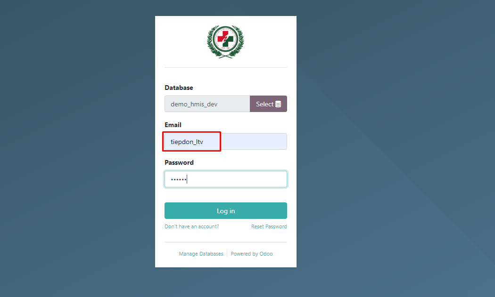

Hình I.1.1 Màn hình đăng nhập

***Bước 2:*** 
Sau khi đăng nhập thành công, màn hình hiển thị menu chính

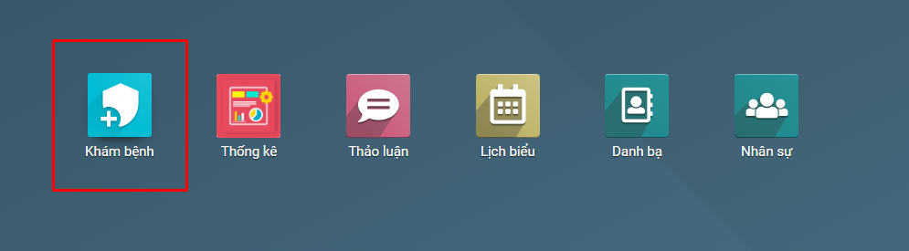

Hình I.1.2 Màn hình menu chính

Người dùng chọn biểu tượng **Khám bệnh,** hệ thống hiển thị danh sách
phiếu tiếp đón ( mặc định hiển thị các phiếu tiếp đón của tất cả các
phòng khám )

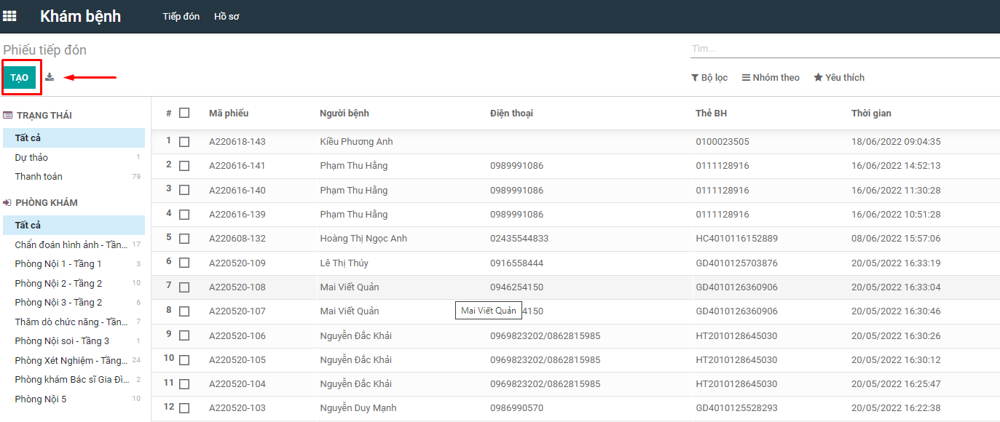

Hình I.1.3 Màn hình danh sách phiếu tiếp đón

***Bước 3:*** Trên màn hình danh sách phiếu tiếp đón, nhấn
nút **Tạo** ở góc trên bên trái màn hình, hệ thống sẽ hiển thi màn hình
thông tin phiếu tiếp đón.

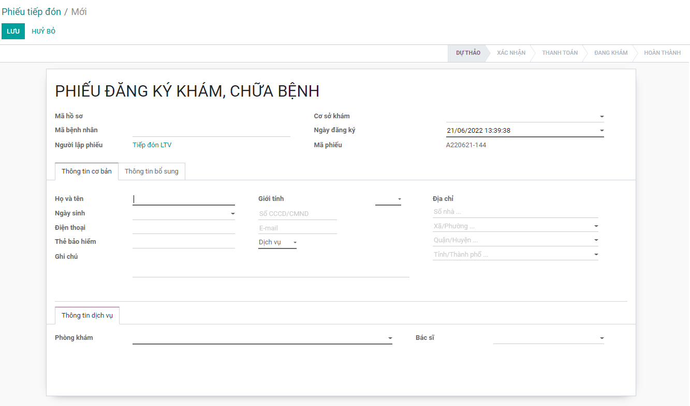

Hình I.1.4 Phiếu tiếp đón người bệnh

Hệ thống hiển thị mã phiếu, người lập phiếu và ngày đăng ký mặc định là
ngày giờ trên máy.

Hệ thống tự động sinh ra mã hồ sơ và mã bệnh nhân.

***Bước 4:*** Người dùng nhập các thông tin sau:

-   ***Thông tin cơ bản***

*TH1: Bệnh nhân không có BHYT*

-   Họ và tên: Nhập họ tên bệnh nhân

-   Ngày sinh: Nhập theo định dạng dd/mm/yyyy

-   Giới tính: Chọn giới tính nam/nữ

-   Điên thoại: Phải nhập

-   Địa chỉ: Phải nhập

-   Căn cước công dân:

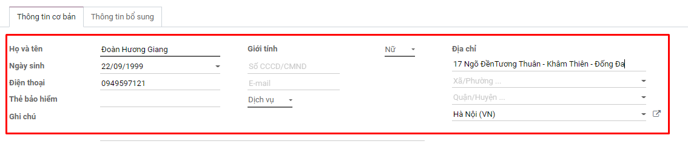

Hình I.1.5

*TH2: Bệnh nhân có BHYT*

-   Họ và tên: Nhập họ tên bệnh nhân

-   Ngày sinh: Nhập theo định dạng dd/mm/yyyy

-   Giới tính: Chọn giới tính nam/nữ

-   Điên thoại: Phải nhập

-   Địa chỉ:

-   Căn cước công dân:

-   Thẻ BHYT: Sau khi nhập số thẻ BHYT của bệnh nhân, hệ thống sẽ check
    xem thẻ BH đó đúng tuyến hay trái tuyến và còn thời hạn sử dụng hay
    không.

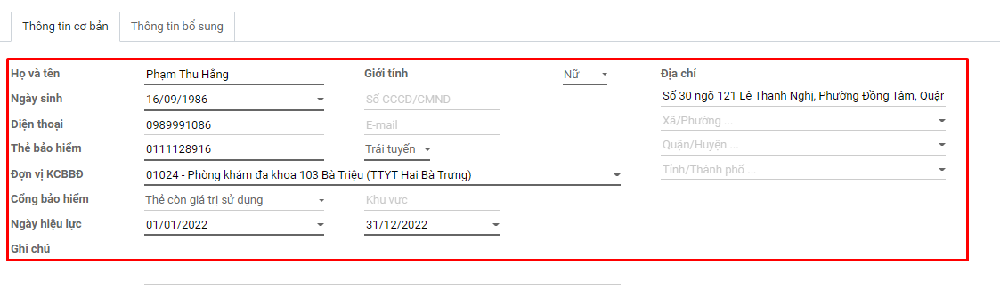

Hình I.1.6

-   ***Thông tin bổ sung \<*** có thể nhập hoặc bỏ qua \>

-   Dân tộc: Chọn trong danh mục có sẵn

-   Tình trạng hôn nhân: Chọn trong danh mục có sẵn

-   Nghề nghiệp:

-   Tôn giáo: Chọn trong danh mục có sẵn

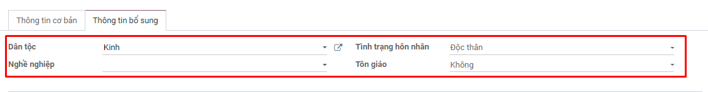

Hình I.1.7

-   ***Thông tin dịch vụ***

-   Phòng khám: Chọn phòng khám theo yêu cầu của bệnh nhân

-   Bác sĩ: Chọn bác sĩ theo danh mục có sẵn

-   Dịch vụ: Chọn dịch vụ theo yêu cầu của bệnh nhân

-   Nếu là bệnh nhân có bảo hiểm thì tích vào ô BH

-   Nếu khám ngoài giờ thì tích vào ô ngoài giờ

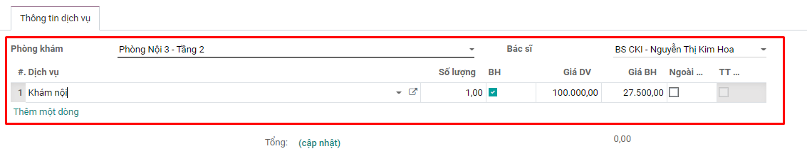

Hình I.1.8

-   Sau khi nhập hết thông tin của người bệnh, người dùng nhấn nút
    **Lưu.** Sau đó check lại thông tin nếu đã chính xác chọn nút **Xác
    nhận.** Sau đó in phiếu tiếp đón.

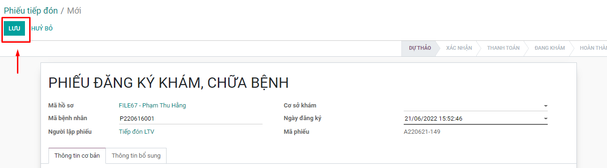

Hình I.1.9

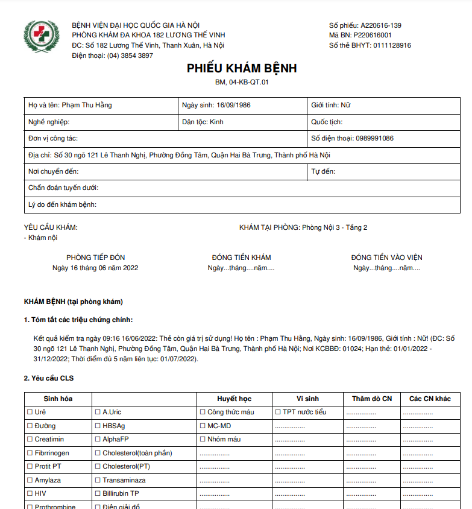

Hình I.1.10 Phiếu tiếp đón

Phiếu tiếp đón in ra đầy đủ thông tin người bệnh, phòng khám và dịch vụ
khám.

***Bước 5:*** Sau khi lưu phiếu tiếp đón, hệ thống sinh ra
phiếu khám và hiển thị thông tin người bệnh trong danh sách tiếp đón.

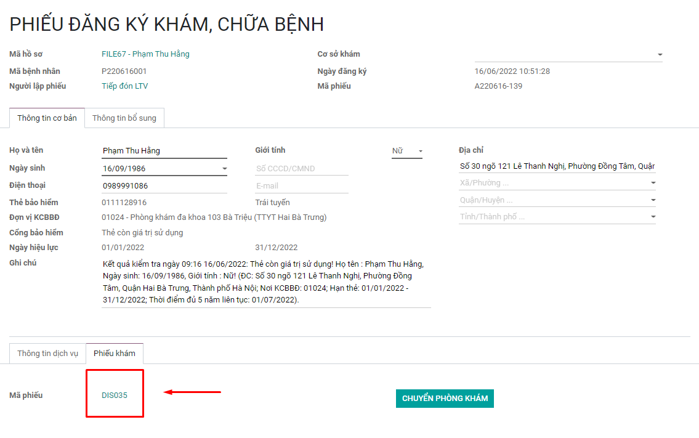

Hình I.1.11 Mã phiếu khám

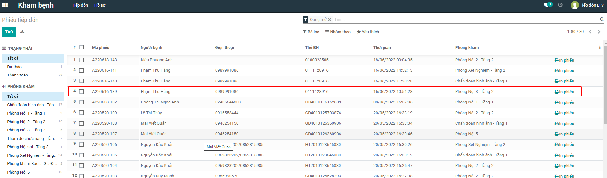

Hình I.1.12

## Thanh toán

### Mục đích

-   Kê các khoản chi phí

-   Thu tiền khám bệnh, tiền dịch vụ cận lâm sàng của bệnh nhân.

-   Thu tiền phần trăm và thanh toán ra viện cho BN có thẻ bảo hiểm y
    tế.

-   Thu tiền tạm ứng viện phí của bệnh nhân nội trú.

-   Thực hiện thu chi, điều chỉnh và thanh toán ra viện cho bệnh nhân
    nội trú

-   Xem tổng hợp thu chi cuối ngày

### Các bước thực hiện

Trên màn hình Đăng nhập, người dùng đăng nhập bằng tài khoản thu ngân

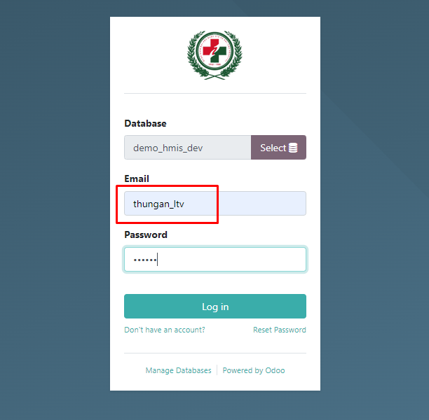

Hình II.2.1 Màn hình đăng nhập

Sau khi đăng nhập thành công, màn hình hiển thị menu chính

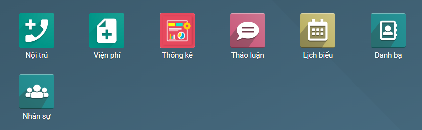

Hình II.2.2 Màn hình menu chính

#### **Ngoại trú**

Sau khi tạo phiếu tiếp đón, trạng thái sẽ chuyển sang người bệnh cần đi
thanh toán

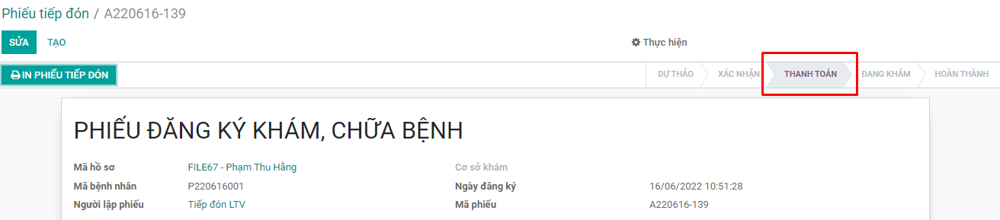

Hình II.2.3

***Bước 1:*** Chọn biểu tượng **Viện phí**, hệ thống hiển
thị danh sách người bệnh cần thanh toán của khoa khám bệnh.

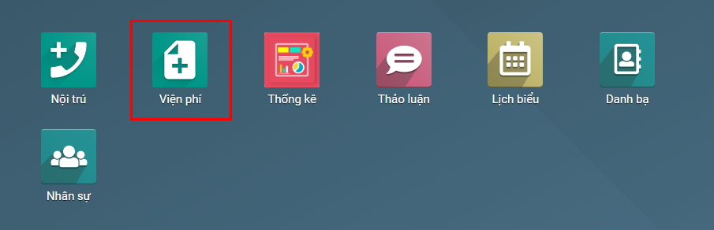

Hình II.2.4

***Bước 2:*** Tên màn hình danh sách, gõ tên bệnh nhân vào
ô tìm kiếm hệ thống sẽ xuất hiện phiếu của bệnh nhân đó.

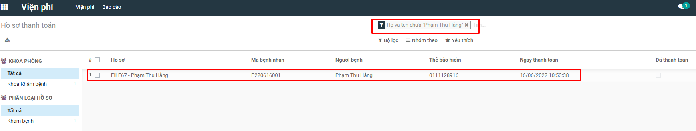

Hình II.2.5

***Bước 3:*** Người dùng chọn đúng theo tên bệnh nhân, hệ
thống hiển thị màn hình hồ sơ thanh toán của bệnh nhân.

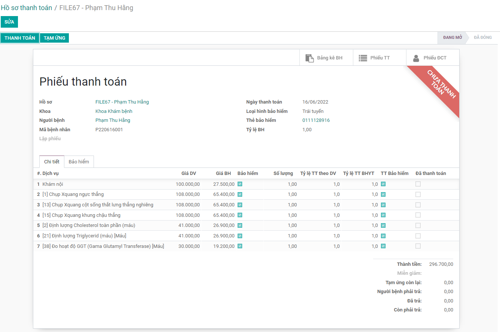

Hình II.2.6 Phiếu thanh toán

Tại đây người chọn biểu tượng tạm ứng, Hệ thống sẽ hiển thị phiếu tạm
ứng

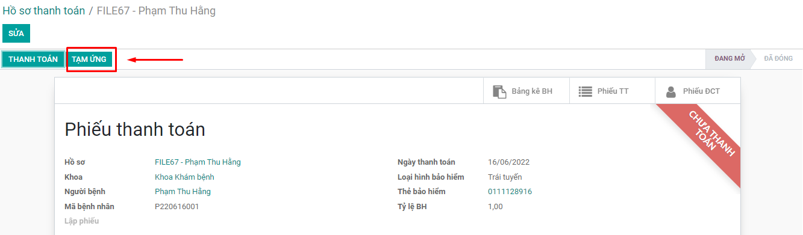

Hình II.2.7

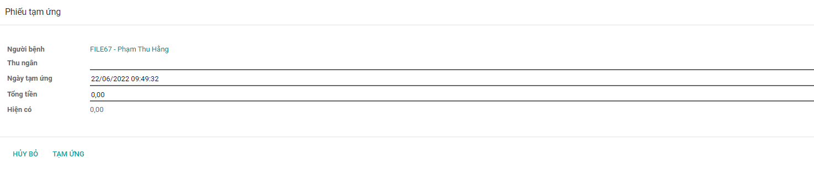

Hình II.2.8 Phiếu tạm ứng

***Bước 4:*** Người dùng nhập thông tin sau

-   Thu ngân: Chọn theo danh mục có sẵn

-   Ngày tạm ứng: Hệ thống mặc định ngày giờ trên máy \< người dùng có
    thể sửa được \>

-   Tổng tiền: Nhập số tiền người bệnh phải nộp

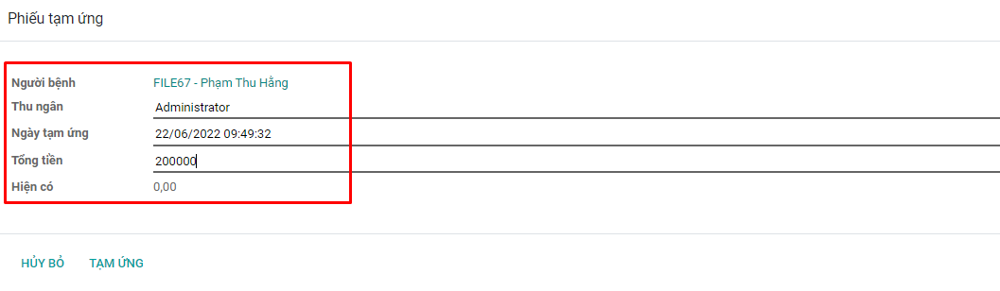

Hình II.2.9

-   Sau khi nhập đầy đủ các thông tin, nhấn nút tạm ứng và nút lưu để tạo phiếu tạm ứng.
- 
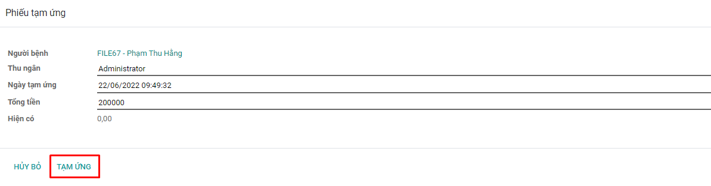

Hình II.2.10

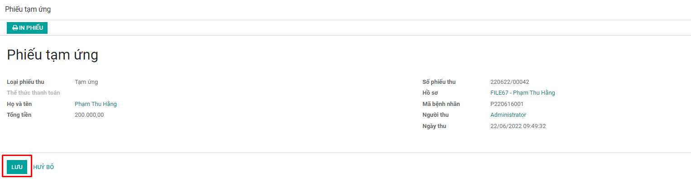

Hình II.2.11

Nhấn nút in phiếu để in phiếu tạm ứng

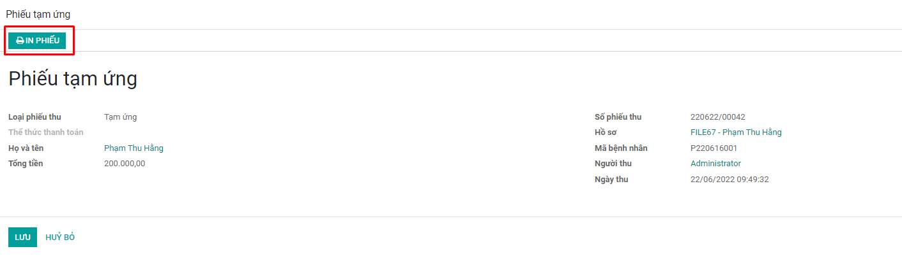

Hình II.2.12

#### **Nội trú**

## Hoạt động khám bệnh

### Mục đích

Cho phép người dùng nhập các thông tin khám bệnh cho bệnh nhân, kê các
dịch vụ cận lâm sàng, kê đơn thuốc.

### Các bước thực hiện

***Bước 1:*** Trên màn hình Đăng nhập, người dùng đăng
nhập bằng tài khoản bác sĩ khoa khám bệnh

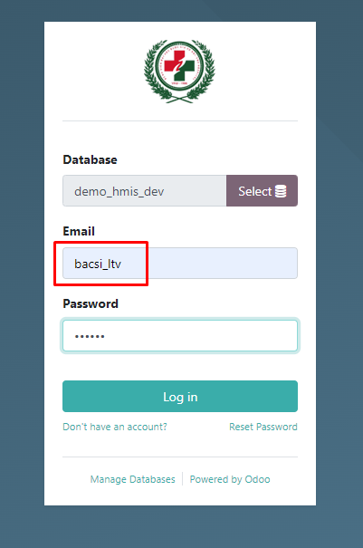

Hình III.2.1 Màn hình đăng nhập

***Bước 2:*** Sau khi đăng nhập thành công, màn hình hiển
thị menu chính

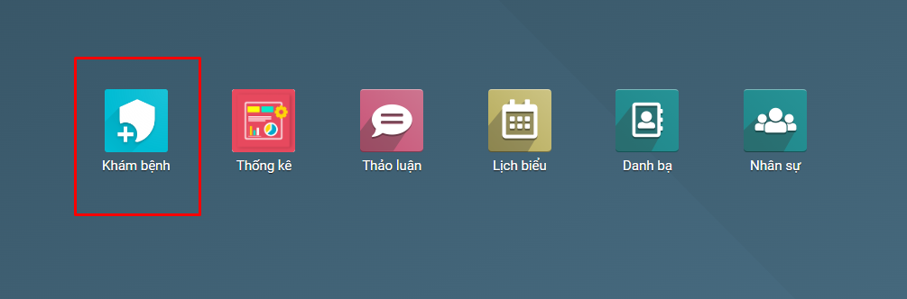

Hình III.2.2 Màn hình menu chính

Người dùng chọn biểu tượng **Khám bệnh,** hệ thống hiển thị danh sách
phiếu khám lâm sàng ( mặc định hiển thị các phiếu tiếp đón của tất cả
các phòng khám )

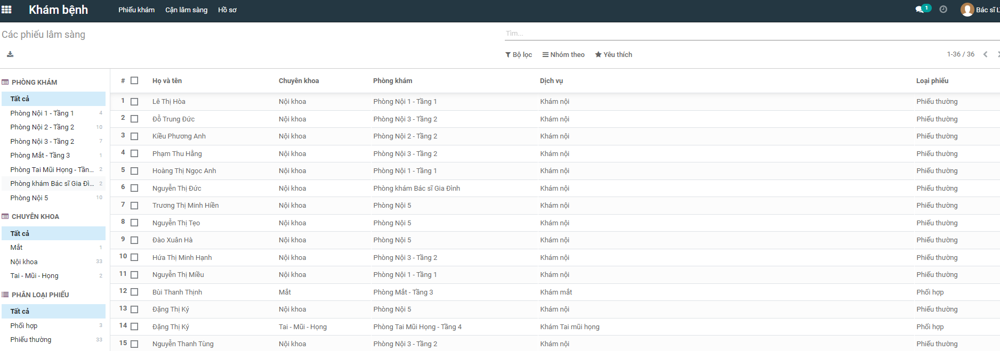

Hình III.2.3 Màn hình danh sách phiếu khám

***[Bước 3:]{.underline}*** Bác sĩ chọn phiếu khám, rồi tiến hành khám
chữa bệnh và nhập thông tin khám chữa bệnh.

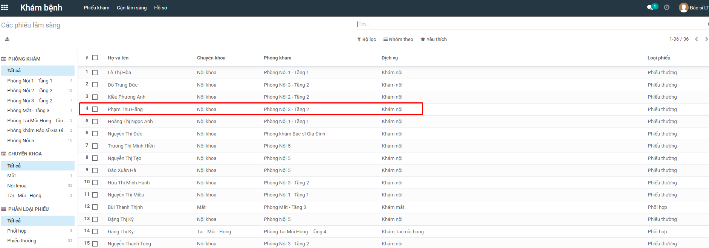

Hình III.2.4

-   Cân nặng: Nhập cân nặng

-   Ngày tháng: Hệ thống sẽ hiện thị ngày giờ mặc định là ngày giờ hiện
    tại. Người dùng có thể sửa lại ngày khám.

-   Bác sĩ khám bệnh: Hệ thống mặc định là bác sĩ được chọn ở lần đầu
    tiên, người dùng có thể chọn lại.

-   Triệu chứng: Nhập triệu chứng của bệnh nhân. Bắt buộc nhập

-   Chẩn bệnh: Chọn bệnh chính cho bệnh nhân theo mã bệnh ICD 10 hoặc
    chọn theo tên bệnh. Mặc định dòng đầu tiên là bệnh chính, các bệnh
    tiếp theo là bệnh kèm theo

-   Bệnh liên quan ( nếu có )

-   Hướng xử lý: Chọn điều trị ngoại trú theo đơn/vào viện

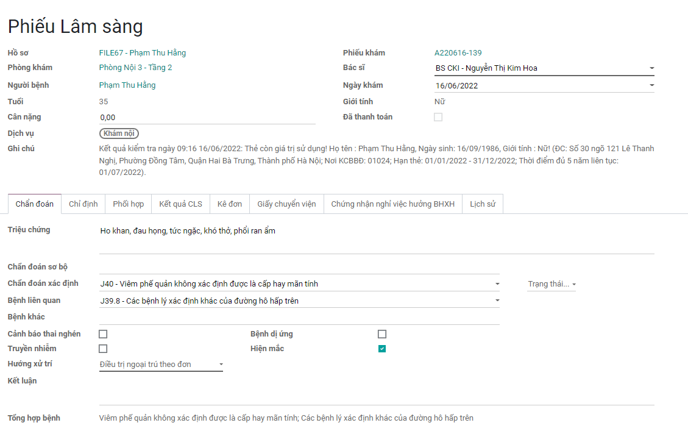

Hình III.2.5 Phiếu lâm sàng

***Bước 4:*** Nếu bác sĩ cần thêm các chỉ định dịch vụ
hoặc phối hợp cùng bác sĩ khoa lâm sàng khác để điều trị cho bệnh nhân
thì nhấn nút **Phối hợp** hoặc **Chỉ định** góc trên bên trái màn hình.

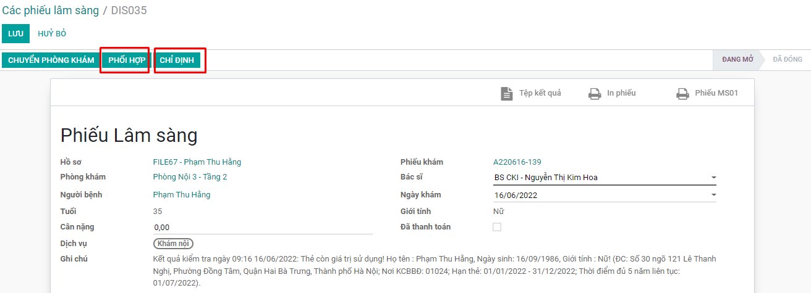

Hình III.2.6

-   *Nếu nhấn nút Chỉ định sẽ ra phiếu chỉ định khám.*

Bác sĩ chọn phòng khám và dịch vụ cần kê ( nhập theo mã dịch vụ hoặc tên
dịch vụ hệ thống sẽ đưa danh sách để người dùng chọn )

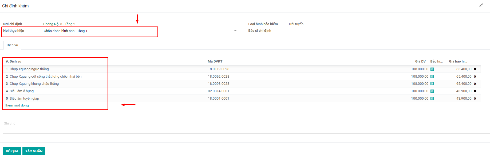

Hình III.2.7 Phiếu chỉ định dịch vụ

-   Nhấn nút xác nhân để lưu phiếu chỉ định dịch vụ. Sau khi xác nhận,
    bác sĩ khoa cận lâm sàng nhận được phiếu khám.

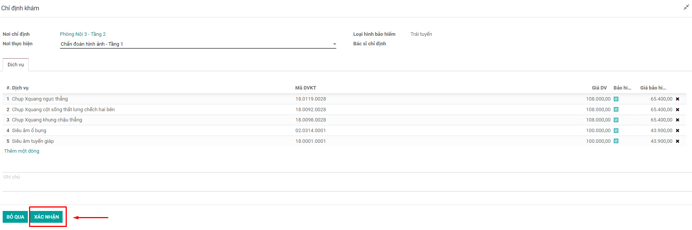

Hình III.2.8

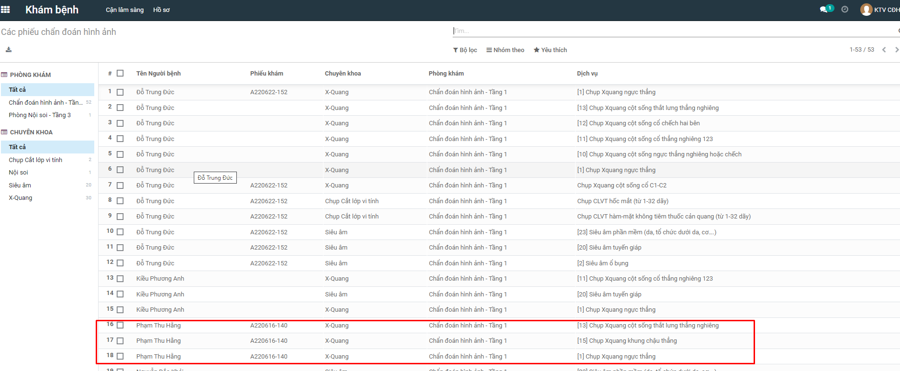

Hình III.2.9 Danh sách phiếu chuẩn đoán dình ảnh

-   *Nếu nhấn nút Phối hợp sẽ ra phiếu gọi phiếu hợp*

Bác sĩ chọn phòng khám trong danh mục rồi nhấn nút phối hợp để tạo phiếu
gọi phối hợp.

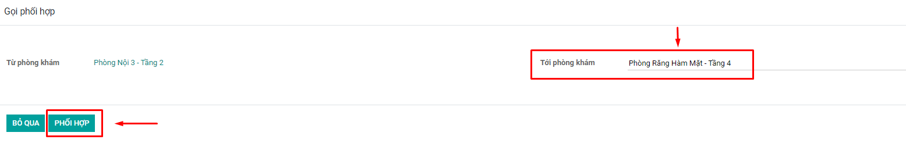

Hình III.2.10 Phiếu gọi phối hợp

Sau đó bác sĩ khoa lâm sàng được gọi phối hợp cùng sẽ nhận được phiếu
khám.

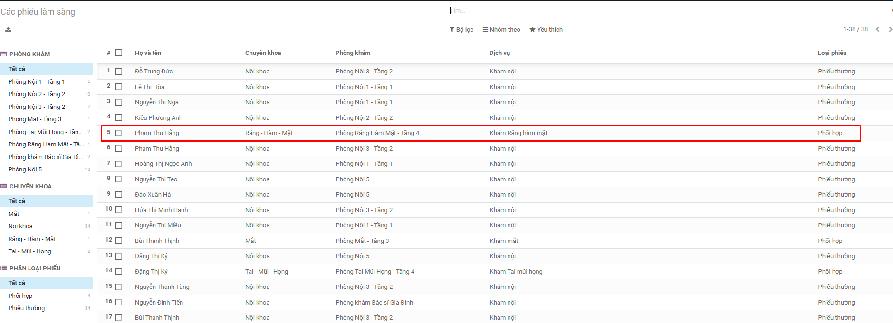

Hình III.2.11 Danh sách phiếu lâm sàng

***Bước 5:*** Sau khi bác sĩ chẩn đoán bệnh và có kết quả
cận lâm sàng, bác sĩ kê đơn cho bệnh nhân.

Tại phiếu khám, chọn tab **kê đơn**

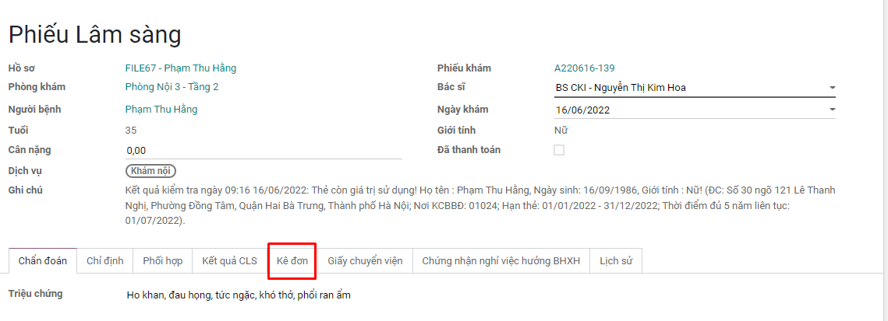

Hình III.2.12 Phiếu khám

Màn hình sẽ xuất hiện giao diện kê đơn:

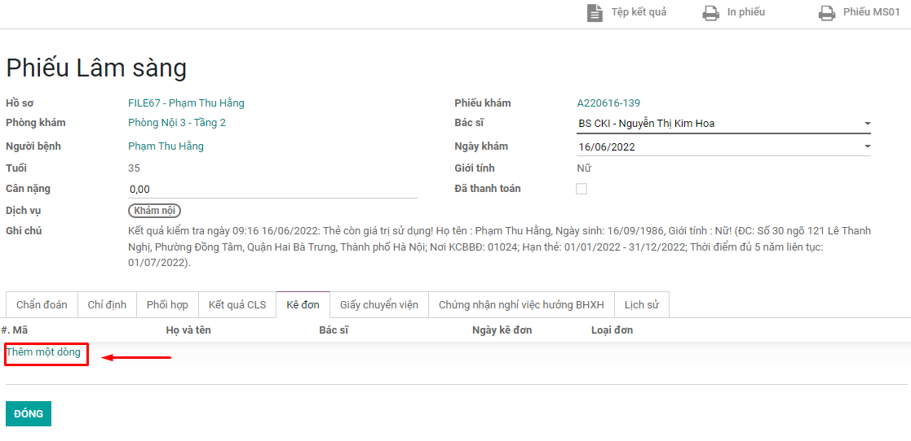

Hình III.2.13 Màn hình kê đơn

Người dùng chọn **thêm một dòng** trong giao diện, hệ thống sẽ hiển thị
**phiếu tạo kê đơn.** Tại đây, bác sĩ nhập thông tin đơn thuốc mới

-   Mã đơn: hệ thống tự sinh mã đơn thuốc

-   Ngày/giờ: mặc định là ngày giờ hiện tại, có thể sửa lại.

-   Bác sĩ: mặc định là bác sĩ khám bệnh, có thể chọn lại

-   Loại đơn: người dùng có thể chọn loại đơn bảo hiểm/nội trú/dịch vụ.

-   Nhập thuốc theo tên hàng hóa \< hệ thống đã có danh mục thuốc \>

-   Số lượng: nhập số lượng từng loại thuốc

-   Số ngày: nhập số ngày người bệnh cần uống

-   Lần/ngày: nhập số lần uống thuốc trong một ngày của người bệnh.

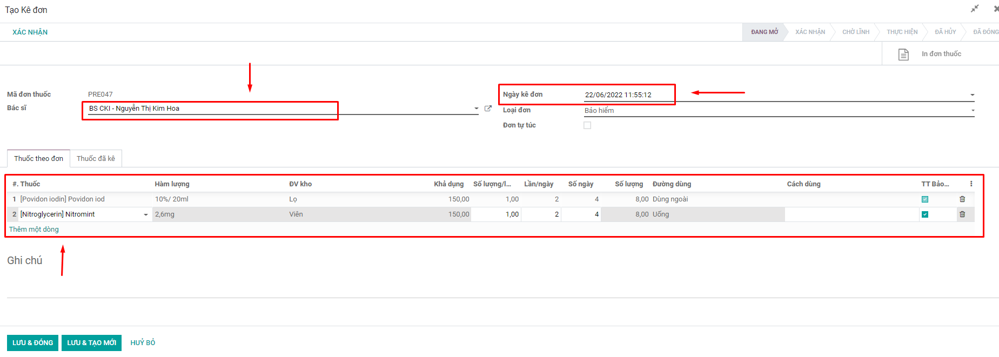

Hình III.2.14 Phiếu kê đơn

Sau khi nhập hết thông tin, người dùng nhấn nút **Xác nhận** và **Lưu**
để lưu thông tin đơn thuốc.

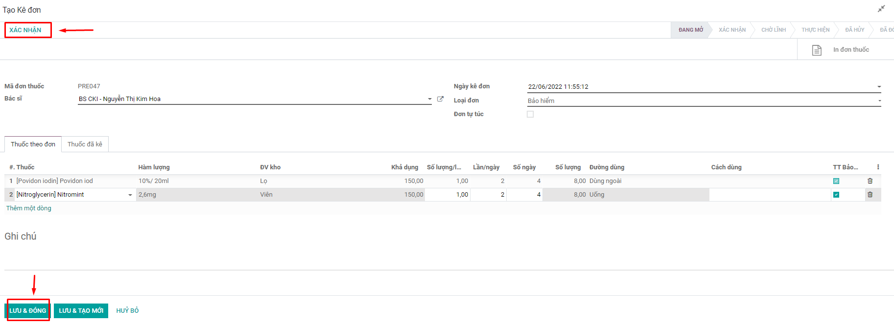

Hình III.2.15

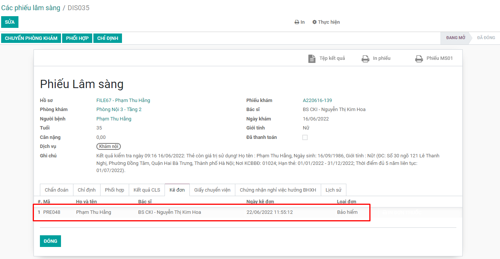

Hình III.2.16 Đơn thuốc đã lưu
